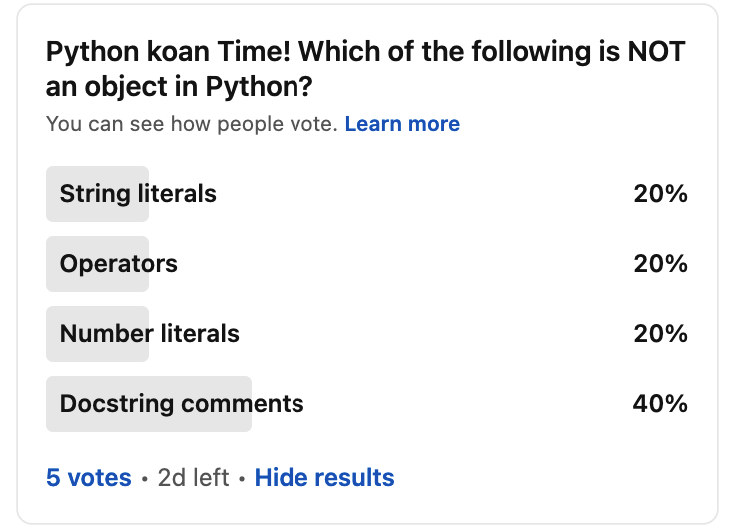

# Day 1 - Which of the Following is Not an Object in Python

I posted a fun Python puzzle as a [poll on LinkedIn](https://www.linkedin.com/posts/codesolid_activity-6876639846971015168-Sd-l/) where I asked folks to guess which of several things was not an object in Python.

Today I thought it would be fun to record a video to share how I discovered the answer.  Once I knew the answer, of course, writing the poll was the easy part.

### Watch the video on Youtube

